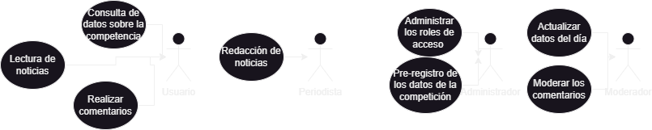
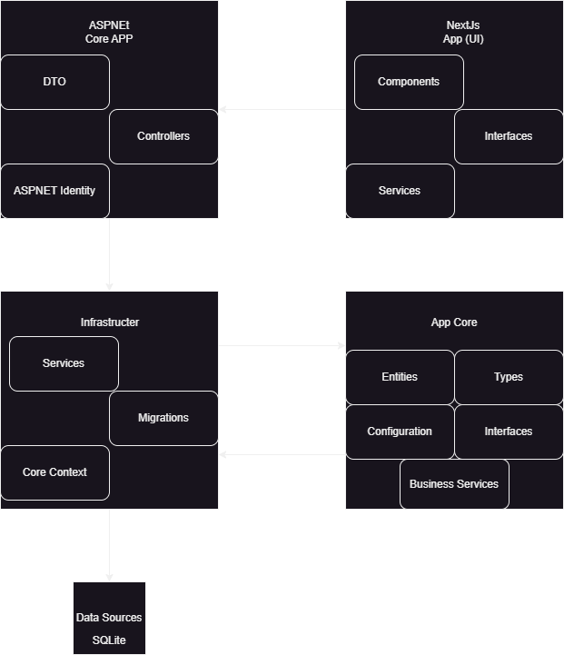
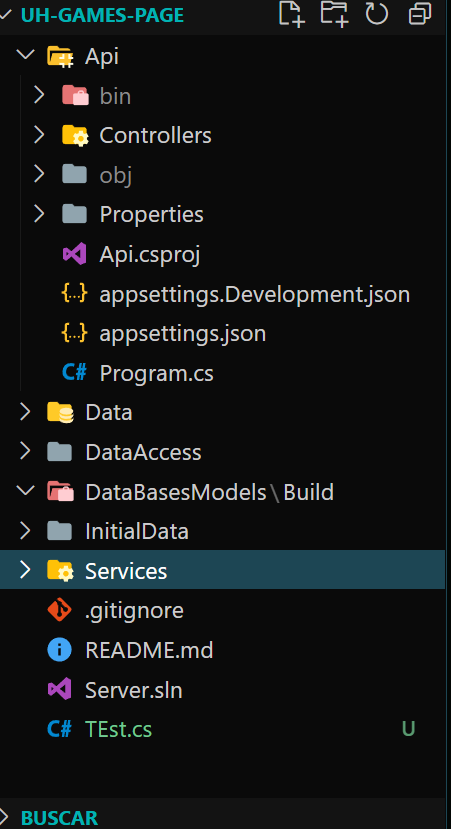
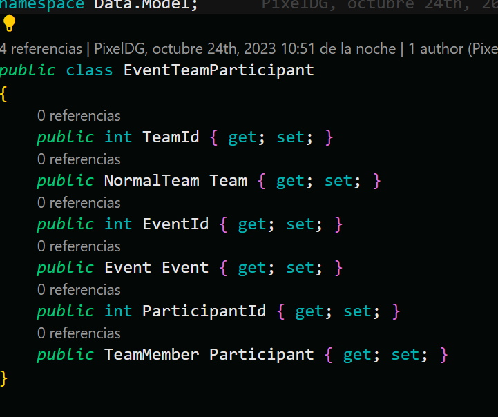

# Indroducción

## Alcance del producto

El alcance del producto abarca a todas las web que quieran mostrar
competencias multideporte, su versatilidad le permite ser usado en otros
escenarios donde haya un enfoque de equipos y enfrentamientos.

Este producto se dirige a la competencia de los Juegos Caribes de la
Universidad de la Habana. Su objetivo es de satisfacer a todo interesado
en la competencia el estado actual de esta conociendo el medallero, asi
como poder conocer el resultado de su facultad, equipo, composición o
atleta de su preferencia.

# Descripción General

## Funcionalidades del producto

La función principal de este producto es de brindar la información del
evento deportivo a todo interesado en esta con disponibilidad de
conexion a internet

1.  Registrar las modalidades deportivas, Facultades y Atletas de la
    competencia.

2.  Actualizar los datos del estado actual de la competencia después de
    cada evento

3.  Brindar una sección de noticias relacionadas con cada evento
    deportivo

4.  Brindar de la información actualizada del estado de cada evento,
    modalidad, deporte, composición, equipo, atleta y facultad, su
    ranking en el medallero y su estado en la competencia.

5.  Realizar comentarios de las noticias

6.  Poder actuar como moderador de los comentarios.

# Características de los usuarios potenciales

Debido a que los Juegos Caribe forman parte de los eventos de la
Universidad de La Habana y están enfocados al cuerpo estudiantil de
dicha institución, se considera a esta comunidad universitaria como
usuarios potenciales de la página web. Este usuario está comprendido en
un rango etáreo que puede abarcar desde los 18 a los 26 años, incluyendo
a aquellos estudiantes que sobrepasan los 23 años debido a cambios de
carrera o que ya son egresados de la universidad y, según lo establecido
en el Reglamento de los Juegos Caribe, pueden participar en el evento.
Se caracterizan principalmente por un gran nivel de familiarización con
las nuevas tecnologías, pues ellas forman parte del crecimiento y
desenvolvimiento social de su generación. Asimismo, el usuario está
interesado en conocer acerca de los partidos y torneos de los Juegos
Caribe, además de conocer la puntuación de las facultades; por tanto, se
convierte dicho interés en una de las misiones de la página.

# Análisis de referentes

Con respecto al estudio de referentes, se pretendió analizar el
comportamiento de las secciones y la visualidad en general de sitios
webs vinculados a grandes eventos deportivos multidisciplinarios; no
obstante, también se tomó como referencia los sitios webs reconocidos de
distintos deportes, como es el caso de LaLiga, NBA, Roland Garros y MLB,
para verificar cómo se administran las estadísticas de partidos, estados
de competencia, noticias, fichas de equipos y perfiles de atletas. Es
por ello que el principal referente consultado para el diseño del sitio
web de los Juegos Caribe fue la página de los Juegos Olímpicos,
basándonos en la interfaz gráfica y presentación de los deportes de
Tokyo 2020.

# Restricciones Generales

## Restricciones del Cliente

El cliente ha expresado su preferencia por:

1.  Una interfaz de usuario intuitiva, la cuál ha sido brindada la
    plantilla por especialistas del ISDI.

2.  Un programa robusto que pueda aceptar el uso simultaneo de varios
    usuarios.

3.  Que sea independiente al lugar de desplieges asi como las
    condiciones de este.

## Requerimientos de entorno 

1.  Servidor con conexión estable a internet u otro medio de conexión
    local para el acceso de este.

2.  Maquina virtual Common Language Runtime (CLR) la cual pueda ejecutar
    código de Common Language Runtime (CLR): Lenguaje intermedio de .Net

3.  Estimado de un mínimo de 4gb de ram para la ejecución de este a bajo
    nivel de concurrencia.

4.  Personal encargado del manetenimiento y actualización de los datos.

## Requerimientos Funcionales

1.  Disponibilidad de personal con responsabilidad de administrador,
    moderador y periodista por parte del cliente.

2.  Confianza absoluta del cliente por el personal de los roles
    anteriores.

3.  Información como el nombre de las facultades, deportes, modalidades,
    atletas, equipos , composiciones y eventos.

# Resumen

La plataforma está diseñada como una solución integral de gestión e
infomación de datos. Para su desarrollo nos basamos en los principios de
diseño y desarrollo solidos y metodoligía ágil garantizando seguridad y
eficiencia. En el documento se abordarán los requerimientos funcionales,
no funcionales y de entorno.

Enfoque en usabilidad y adaptabilidad a diferentes dispositivos.
Seguridad mediante autenticación basada en usuario - contraseña segura y
tokens JWT. Uso de una variedad de tecnologías, incluyendo ASP.NET Core,
Nextjs, y TypeScript, Compatibilidad del producto con una variedad de
sistemas operativos y requisitos de memoria RAM, CPU y espacio en disco
recomendados. Se presentarán las funcionalidades del producto usando un
diagrama de casos de uso del sistema. Se justificará la selección de la
metodología de desarrollo Scrum, con sprints de 2 semanas, reuniones de
SCRUM regulares, reuniones de retrospectiva y sprint review. Se mostrará
el uso de herramientas como \"projects\" de GitHub para el seguimiento
del progreso. Se presentará un diagrama de la arquitectura escogida, que
es la arquitectura limpia con separación de responsabilidades, y se
dirán las ventajas de su uso por las que se escogió para el desarrollo
del proyecto. Se detallarán los patrones de repositorio y unidad de
trabajo para acceso a datos que fueron elegidos para la realización del
proyecto. Se verán los principios de diseño que se aplican, como SOLID,
YAGNI (You Aren't Gonna Need It) y KISS (Keep It Simple, Stupid) para
mantener la simplicidad y evitar la implementación de características
innecesarias. Al final se presentará el modelo que determina la
estructura de la base de datos del proyecto.

# Seguridad

## Confidencialidad {#confidencialidad .unnumbered}

Los datos solo pueden ser modificados por usuarios con identidad y
contraseña debidamente guardada, los cuales su asignación en cada rol
queda del lado del cliente. Se ha confirmado por parte del cliente que
el modelo jerárquico propuesto satisface sus condiciones y que es de su
cargo la confianza en ellos, especialmente en el administrador.
```c#
    public class Usuario
    {
        public int Id { get; set; }
        public string NombreUsuario { get; set; }
        public string ContrasenaHash { get; set; }
        public string Rol { get; set; }
        // Otras propiedades
    }

    // Funcion para verificar las credenciales de un usuario
    public bool VerificarCredenciales(string nombreUsuario, string contrasena)
    {
        // Buscar al usuario en la base de datos por nombre de usuario
        var usuario = _dbContext.Usuarios.FirstOrDefault(u => u.NombreUsuario == nombreUsuario);
        if (usuario != null)
        {
            // Verificar la contrase~na utilizando el hash almacenado
            var contrase~naHashIngresada = CalcularHashContrasena(contrasena, usuario.NombreUsuario);
            return usuario.ContrasenaHash == contrasenaHashIngresada;
        }
        return false;
    }

    // Funcion para calcular el hash de la contrasena
        public string CalcularHashContrasena(string contrasena, string salt)
    {
        using (var sha256 = SHA256.Create())
        {
            var contrasenaSalted = contrasena + salt;
            var hashBytes = sha256.ComputeHash(Encoding.UTF8.GetBytes(contrasenaSalted));
            return BitConverter.ToString(hashBytes).Replace("-", "").ToLower();
        }
    }
```
1.  Uso de encriptación de contraseñas mediante Hash sha256

2.  Comprobación del usuario por su id y contraseña

Validación mediante JWT:
```c#	
        public class JwtService
    {
        private readonly string _secretKey;

        public JwtService(string secretKey)
        {
            _secretKey = secretKey;
        }

        public string GenerateToken(string username, int userId)
        {
            var tokenHandler = new JwtSecurityTokenHandler();
            var key = Encoding.ASCII.GetBytes(_secretKey);

            var tokenDescriptor = new SecurityTokenDescriptor
            {
                Subject = new ClaimsIdentity(new Claim[]
                {
                    new Claim(ClaimTypes.Name, username),
                    new Claim(ClaimTypes.NameIdentifier, userId.ToString())
                }),
                Expires = DateTime.UtcNow.AddDays(7),
                SigningCredentials = new SigningCredentials(new SymmetricSecurityKey(key), SecurityAlgorithms.HmacSha256Signature)
            };

            var token = tokenHandler.CreateToken(tokenDescriptor);
            return tokenHandler.WriteToken(token);
        }

        public ClaimsPrincipal ValidateToken(string token)
        {
            var tokenHandler = new JwtSecurityTokenHandler();
            var key = Encoding.ASCII.GetBytes(_secretKey);

            try
            {
                tokenHandler.ValidateToken(token, new TokenValidationParameters
                {
                    ValidateIssuerSigningKey = true,
                    IssuerSigningKey = new SymmetricSecurityKey(key),
                    ValidateIssuer = false,
                    ValidateAudience = false,
                    ClockSkew = TimeSpan.Zero
                }, out var validatedToken);

                return validatedToken?.Principal;
            }
            catch
            {
                return null;
            }
        }
    }

1.  Los tokens JWT se usarán para autorizar a los usuarios a acceder a
    recursos específicos de la aplicación web dependiendo de su rol.

2.  Los tokens JWT se firmán digitalmente con una clave secreta
    (guardada como variable de entorno). Esto ayuda a proteger los datos
    del usuario.

## Integridad

1.  Mediante el control de sesiones se garantiza la integridad del
    programa, protegiendo de la corrupción de datos.

2.  Mediante el uso de moderadores de comentarios se dispondrá de un
    filtro sobre comentarios no deseados o acordes con las políticas del
    cliente.

## Disponibilidad

Garantizaremos la capacidad de nuestra aplicación para proporcionar
acceso a los datos y servicios cuando se necesita mediante la
implementación eficiente, dentro del alcance posible, de las solicitudes
al servidor y consultas a la base de datos. Para esto tendremos en
cuenta las siguientes técnicas:

1.  El desarrollos sobre entornos pensado para la portabilidad de este,
    robusto y con años de confianza por parte de la comunidad

2.  Optimización del código, la cual asegura que el código de la
    aplicación web esté bien escrito y optimizado para el rendimiento.

3.  Utilización de un almacenamiento de datos eficiente asi como un ORM
    robusto y eficiente.

4.  Consultas ligeras: Evitar hacer consultas que requieran una gran
    cantidad de datos. Limitar las consultas a los datos que son
    realmente necesarios.

5.  La tolerancia a fallos: Implementar mecanismos para que la
    aplicación pueda recuperarse de fallos.

# Funcionalidades del producto

## Story Board

.jpeg){width="\\textwidth" height="\\textheight"}

## Diagrama de descripción de actores

{width="\\textwidth"
height="\\textheight"} En el diagrama de descripción anterior se
muestran los roles de cada actor.

## Descripción de roles

1.  **Usuario Común:** Este tipo de usuario no necesita verificación y
    puede realizar las siguientes acciones:

    1.  Navegar por la página principal de la plataforma.

    2.  Acceder a la información de los deportes

    3.  Realizar búsquedas específicas de deportes o equipo

2.  **Administrador:** Este tipo de usuario tiene acceso a todas las
    funcionalidades de la plataforma y puede realizar cualquier tipo de
    acción.

3.  **Periodista:** Este tipo de usuario tiene acceso a una sección
    específica en la página web donde puede insertar noticias
    relacionadas con los deportes. Esta sección solo es visible para el
    periodista y el administrador.

4.  **Moderador:** Este tipo de usuario se encarga de insertar los
    resultados de los partidos y la información relacionada con los
    mismos.

# Enfoque Metodológico

Se decidió utilizar Scrum porque es una metodología ágil que puede ser
muy beneficiosa para el desarrollo del proyecto por varias razones:

1.  **Iteraciones cortas y entregas frecuentes:** Scrum se basa en
    sprints, que son períodos de tiempo cortos (en nuestro caso 2
    semanas) durante los cuales se completa un conjunto definido de
    tareas, lo que tiende a aumentar la productividad y la
    concentración. También permite proporcionar actualizaciones
    frecuentes y tangibles a las partes interesadas, lo que puede ser
    especialmente útil en un mercado en constante cambio como el de las
    agencias de viajes.

2.  **Adaptabilidad:** Dado que Scrum se basa en la inspección y
    adaptación constantes, podemos ajustar rápidamente los planes y
    prioridades en respuesta a los cambios en los requisitos del
    negocio.

3.  **Enfoque en el valor del negocio:** En Scrum, las tareas se
    priorizan en función de su valor para el negocio. Esto asegura que
    estemos siempre trabajando en las características que proporcionarán
    el mayor valor a los clientes.

4.  **Transparencia:** Scrum proporciona una visibilidad clara del
    progreso del proyecto a todas las partes interesadas a través de sus
    artefactos (como el backlog del producto y el gráfico de burndown) y
    ceremonias (como la planificación del sprint y la revisión del
    sprint).

5.  **Colaboración y comunicación mejoradas:** Scrum fomenta la
    colaboración y la comunicación abierta entre los miembros del equipo
    y las partes interesadas. Esto puede ser especialmente beneficioso
    porque nuestro equipo está compuesto por personas con diferentes
    habilidades y antecedentes.

Impelementación de la Metodología:

1.  **Duración de los Sprints:** 10 diás cada uno.

2.  **Frecuencia de las reuniones( SCRUM o Stand-up):** Martes y
    Viernes. Esta programación nos brinda una visión actualizada del
    avance del proyecto y permite abordar cualquier dificultad.

3.  **. Reuniones de Retrospectiva y Sprint Review:** Domingos. Nos
    permite evaluar el desempeño del equipo y pudiendo programar ajustes
    futuros.

4.  **Herramientas de Control del Progreso:** Se utilizan varias vías:

    1.  **Github Projects** para tener compartido el RoadMap, además
        poder seleccionar las tareas a terminar.
        {width="\\textwidth"
        height="\\textheight"}

    2.  **Grupo en telegram** con división y pignorado de mensajes según
        el debate.

    3.  **Code With Me** de JetBrains para la programación colaborativa
        en tiempo real

# Arquitectura

La Arquitectura Limpia también es una opción sólida para el desarrollo
de una página web que muestre resultados de una competencia, ya que se
caracteriza por su alta modularidad y separación de responsabilidades,
lo que la hace especialmente adecuada para aplicaciones web
empresariales y escalables.

A continuación se presentan algunos de los beneficios clave de la
Arquitectura Limpia:

-   Separación de Responsabilidades: La Arquitectura Limpia divide
    claramente la aplicación en capas y componentes, lo que facilita la
    comprensión y el mantenimiento del código. Esto es crucial en
    aplicaciones empresariales, donde se espera que el código sea
    escalable y fácil de mantener.

-   Independencia de la Infraestructura: La Arquitectura Limpia separa
    la lógica de negocio de la infraestructura, lo que significa que la
    lógica empresarial no depende de frameworks o tecnologías
    específicas. Esto permite cambiar la tecnología subyacente sin
    afectar la funcionalidad principal de la aplicación.

-   Testabilidad: La separación de responsabilidades y la independencia
    de la infraestructura facilitan la escritura de pruebas unitarias y
    de integración. Esto es esencial para garantizar la calidad del
    software y la detección temprana de errores.

-   Escalabilidad: La modularidad de la Arquitectura Limpia permite
    escalar componentes de manera individual. Puedes escalar la capa de
    presentación, la capa de aplicación y la capa de dominio según sea
    necesario sin afectar otras partes de la aplicación.

-   Reutilización de Código: La claridad en la separación de
    responsabilidades y la independencia de la infraestructura promueve
    la reutilización del código en diferentes partes de la aplicación,
    lo que ahorra tiempo y esfuerzo en el desarrollo.

{width="\\textwidth" height="\\textheight"}
{width="\\textwidth"
height="\\textheight"}

# Patrones

La implementación de la Arquitectura Limpia en el desarrollo de una
aplicación web para mostrar los resultados de una competencia es una
opción sólida que se basa en varios principios de diseño SOLID. Se
utilizará el patrón Repositorio para abstraer y gestionar las
operaciones de acceso a datos de una manera más estructurada y facilitar
la reutilización del código en toda la aplicación. Se creará una capa de
acceso a datos que contendrá una serie de repositorios personalizados,
cada uno actuando como una capa de abstracción sobre el DbContext de
Entity Framework y utilizando métodos proporcionados por EF para llevar
a cabo las operaciones de lectura y escritura. La clase DbContext será
el punto central para administrar la conexión a la base de datos y las
transacciones, rastreando las entidades, realizando seguimiento de los
cambios y administrando la comunicación con la base de datos.

Se aplicarán los siguientes principios de diseño SOLID:

-   Principio de responsabilidad única: Se descompondrán las clases y
    módulos en unidades lógicas, cada una con una única responsabilidad.
    Esto permitirá modificar o extender una funcionalidad sin afectar
    otras partes del sistema.

-   Principio de abierto/cerrado: La aplicación web permitirá la
    extensión de funcionalidades sin modificar el código existente. Se
    utilizarán la herencia, interfaces y patrones de diseño para agregar
    nuevas características o servicios sin alterar las clases
    existentes, asegurando que la aplicación sea fácilmente adaptable a
    futuras mejoras.

-   Principio de sustitución de Liskov: Se garantizará que las subclases
    hereden y extiendan el comportamiento de las superclases de manera
    coherente y predecible, sin romper la funcionalidad del sistema.

-   Principio de segregación de interfaces: Se dividirán las interfaces
    en conjuntos más pequeños y específicos, evitando que las clases
    implementen métodos que no son relevantes para su funcionalidad y
    permitiendo una mejor organización del código.

-   Principio de inversión de dependencias: Las clases de alto nivel
    dependerán de abstracciones en lugar de implementaciones concretas,
    proporcionando flexibilidad y permitiendo cambiar las
    implementaciones concretas sin afectar a los módulos de alto nivel.

Además, se adoptarán los principios YAGNI (You Aren't Gonna Need It) y
KISS (Keep It Simple, Stupid) en el diseño de la aplicación. Se centrará
en proporcionar las capacidades esenciales que los usuarios necesitarán
para utilizar la aplicación de manera efectiva desde el principio,
evitando la implementación de funcionalidades no necesarias en este
momento. Se mantendrá una interfaz de usuario simple y fácil de navegar,
lo que se traducirá en un diseño limpio y una estructura intuitiva que
permitirá a los usuarios encontrar y utilizar las funcionalidades de la
aplicación de manera eficiente. Se evitará la incorporación de
características innecesariamente complejas o detalles superfluos en la
aplicación, lo que se traducirá en un código más limpio y fácil de
mantener.

# Modelo de Base de Datos

{width="\\textwidth" height="\\textheight"}

## Implementación

Se utiliza una base de datos relacional: SQLite la cual por su
versatilidad y facilidad de configuración y uso de recursos ha sido la
adecuada para este proyecto. Se ha realizado el desarrollo del modelo de
esta y su integración con el resto de la API se ha realizado mediante
EntityFramework, ORM el cual nos permite con eficiencia relizar la
creación de la misma desde un modelo de clases y poder hacer migraciones
automaticas, ademas del uso de las consulta LINQ

[width=200]
[height=200]